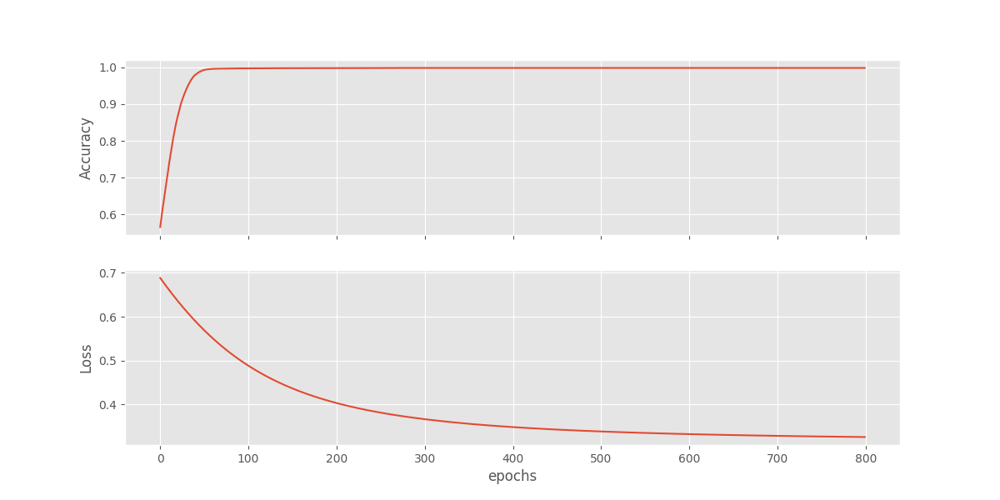

# zero-enter-antifraud

## Dataset

The dataset of credit card transactions produced by IBM is publicly accessible and features a range of transaction details. It serves as a valuable source for fraud detection model testing and research. The dataset comprehensively includes information such as transaction amount, card type, transaction location and a marker denoting the legitimacy of the transaction. This dataset closely mirrors real-world transaction scenarios which entails a higher prevalence of legitimate transactions compared to fraudulent ones leading to class imbalance. The data included is provided by IBM and is synthetically generated, however, the particular process of simulation is not disclosed. It should be acknowledged that this data doesn't entail actual transactions or relate to any real customers or banks. 

The dataset comprises:

- 24 million distinctive transactions
- 6,000 individual merchants
- 100,000 different cards
- 30,000 instances of fraud (representing 0.1% of. all transactions)

You can download it from the following links:
- https://drive.google.com/file/d/1yPf-39SInXyEtcjviH9e0qn-Rrn-t_8F/view?usp=sharing
- https://www.kaggle.com/datasets/ealtman2019/credit-card-transactions?select=User0_credit_card_transactions.csv
- https://ibm.ent.box.com/v/tabformer-data

Just download it and unzip to data folder.


### Fast Analysis


## Graph Modeling

### Fraud detection using GNN and multigraph:

The construction of a multigraph powered for fraud detection using transaction data, followed by usage of a Graph Neural Network (GNN) on the respective edge list, can be achieved in the following stages:
- Data Preparation: Collection and rearrangement of the transaction data is essential which will aid in formulating the multigraph edges. A single transaction may be portrayed as a tuple (node1, node2, attributes) where node1, node2 denote the transaction sender and recipient respectively along with attributes being a dictionary entailing transaction specifics such as amount, timestamp, and type.

- Multigraph Construction: NetworkX library aids in establishing the multigraph using the transaction data. method ```addedge()``` can be utilized to introduce edges to the multigraph with each signifying an individual transaction.

- Extraction of edge list and corresponding features: Applying method ```edges()``` on the multigraph helps extract the list of edges and their features, which can be leveraged as input for the GNN.

- Application of GNN on the edge list: GNNs can be used on the edge list via libraries like PyTorch Geometric, Deep Graph Library (DGL), or Spektral. The GNN classifies the edges in the multigraph as either fraudulent or genuine by learning their representations.

- Evaluation: Model performance can be assessed by segregating the data into training and testing sets. Testing set results help determine the model's accuracy, precision, recall, and F1-score.

### Graph Construction

While creating a graph with transaction-based edges between cardid and merchantname, nodes in the graph need to be defined first. Here, cardid and merchantname constitute these nodes. An extraction of cardid and merchantname information from the tabular data is stored into distinct lists to construct these nodes.

Edges between these nodes are added next, symbolizing transactions between a specific cardid and merchantname. Edges are created by compiling a list of transactions and introducing an edge between the cardid and merchantname for every transaction.


Use the ```nx.MultiGraph()``` function from NetworkX library to shape an empty multigraph object termed as G. Nodes corresponding to every unique cardid and merchantname from the dataframe df are then assigned.

The addnodesfrom method aids in node addition to the graph while iterating over an input. The commands ```df["cardid"].unique() ```and ```df["Merchant Name"].unique()``` return lists of unique cardids and merchant names in the dataframe respectively.

A type attribute is allocated to each node for distinguishing between cardid and merchantname nodes, useful for future graph analysis.

Reason for opting a multigraph over the graph:

Instances where the same user (cardid) procures from the identical merchant (Merchant Name) multiple times can lead to multiple edges between the involved user and merchant. This necessitates the requirement for a multigraph instead of a graph.


### Train result


